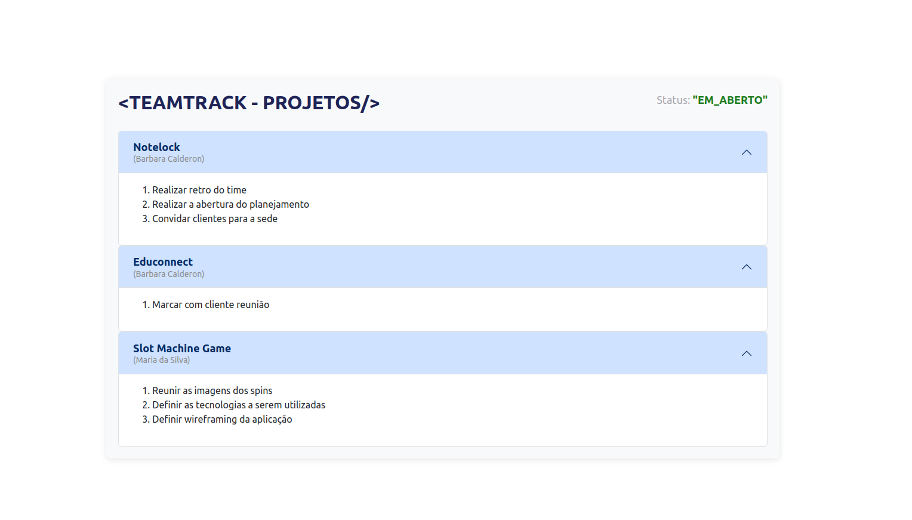
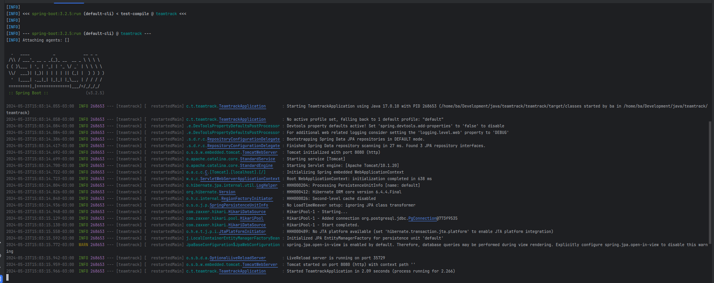
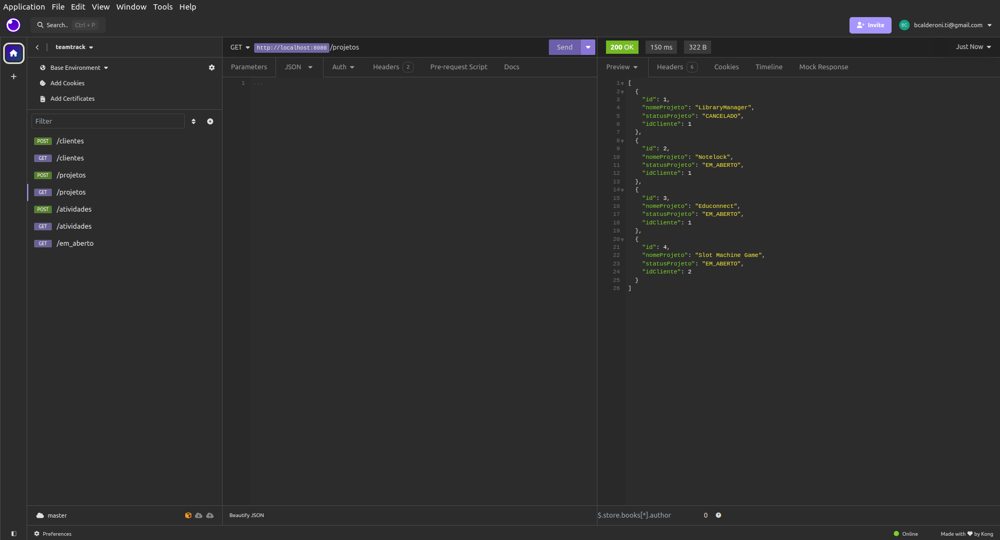
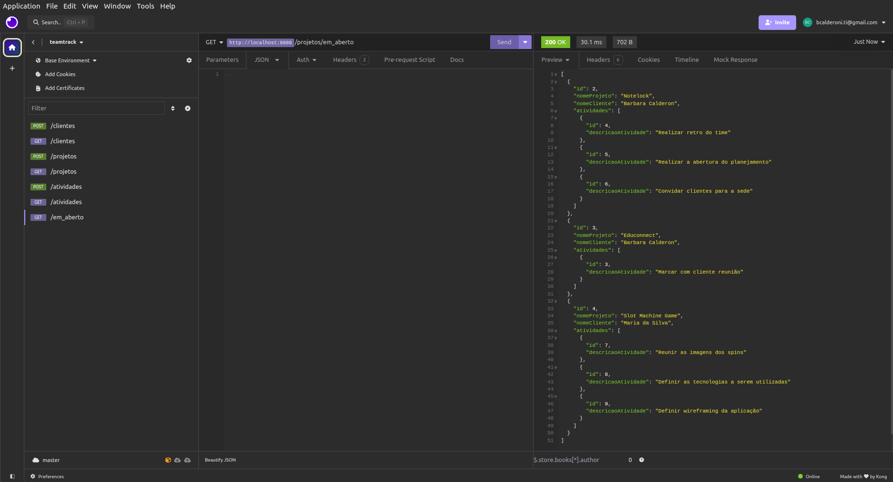
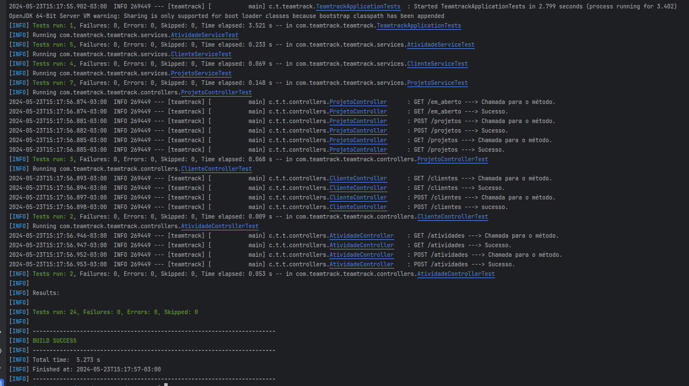
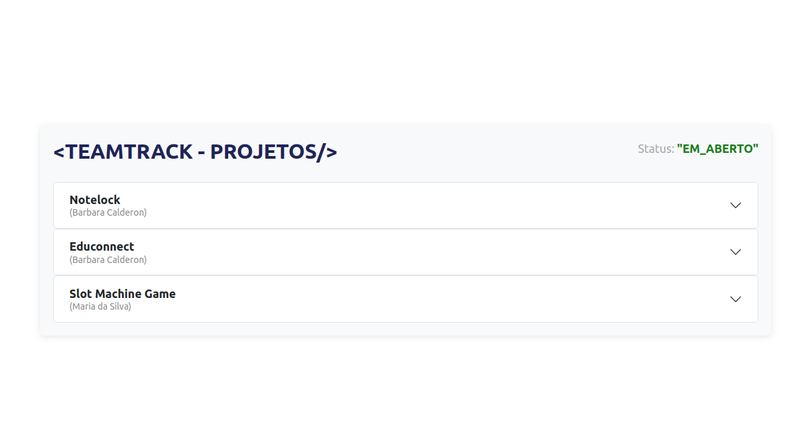
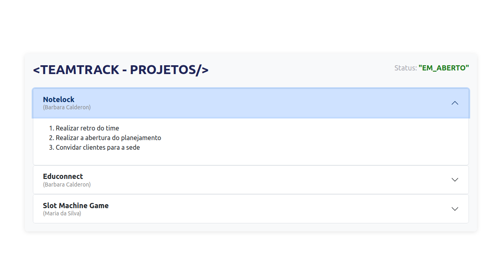
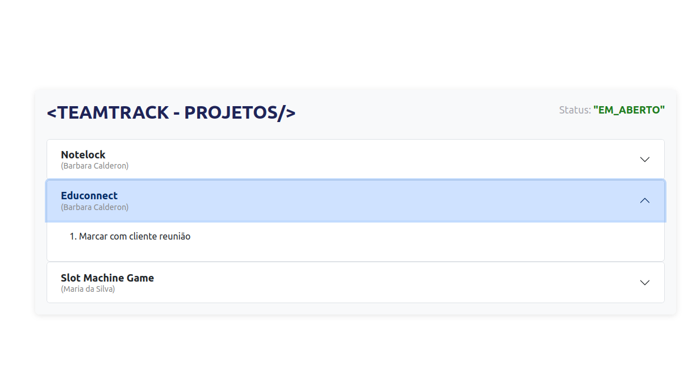
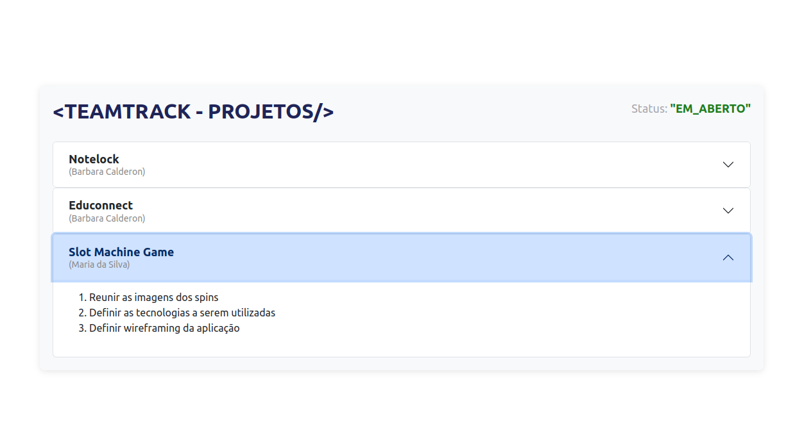
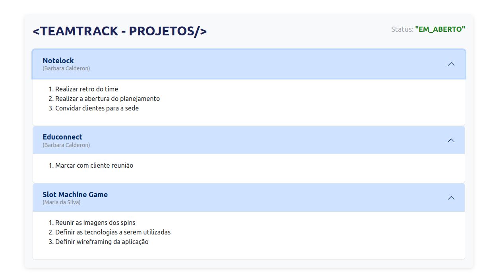

# TeamTrack

O TeamTrack é um aplicativo de gerenciamento de projetos para manter o rastreio de seus clientes e atividades.



## Funcionamento Geral da Aplicação

Para a aplicação funcionar localmente, é preciso seguir alguns passos importantes. O detalhamento desses passos será dado adiante, mas a visão geral é a seguinte:

1. Primeiramente, defina um banco de dados com nome "teamtrack" no PostgreSQL, com senha própria.
2. Suba o servidor backend em `http://localhost:8080`.
3. Com isso, é possível fazer requisições para os endpoints da API: `/clientes`, `/projetos`, `/atividades`.
4. Recomenda-se realizar requisições por meio de aplicativos como Insomnia ou Postman.
5. Suba também o servidor frontend em `http://localhost:5173`.
6. A tela da aplicação será mostrada conforme a imagem acima: a diferença é que serão mostrados os projetos, clientes e atividades conforme definidos pelo usuário nas requisições com a API. A imagem acima mostra um exemplo.

## Autor

Barbara Calderon, desenvolvedora de software.

- [Github](https://www.github.com/barbaracalderon)
- [LinkedIn](https://www.linkedin.com/in/barbaracalderondev)
- [Twitter](https://www.x.com/bederoni)

## Tecnologias Usadas

### Backend

- **Linguagem:** Java 17
- **Framework:** Spring Boot 3.2.5
- **Banco de Dados:** PostgreSQL
- **Dependências Principais:**
  - Spring Boot Starter Data JPA
  - Spring Boot Starter Web
  - Spring Boot DevTools
  - Lombok
  - Jakarta Validation API
  - Spring Boot Starter Test
  - JUnit
  - Mockito

### Frontend

- **Linguagem:** JavaScript
- **Framework:** Vue.js 3
- **Ferramenta de Build:** Vite
- **Estilização:** Bootstrap 4.5.2, CSS3
- **Gerenciamento de Estado:** Pinia
- **HTML5**

Também foi utilizado o Insomnia para requisições ao servidor backend e povoamento do banco de dados TeamTrack.

## Instruções de Configuração - Backend

1. Clone o repositório:

   ```bash
   git clone git@github.com:barbaracalderon/teamtrack.git

2. Crie um banco de dados no PostgreSQL com nome "teamtrack"

3. Configure o arquivo application.properties

```properties
spring.application.name=teamtrack
server.port=8080
spring.datasource.url=jdbc:postgresql://localhost:5432/teamtrack
spring.datasource.username=postgres
spring.datasource.password=[sua senha aqui]
spring.datasource.driver-class-name=org.postgresql.Driver
spring.jpa.properties.hibernate.format_sql=true
spring.jpa.hibernate.ddl-auto=update
spring.jpa.show-sql=true
```

4. Execute a aplicação

```bash
./mvnw spring-boot:run
```



O servidor será iniciado em http://localhost:8080/

5. Uso pelo Insomnia

Recomenda-se o uso do Insomnia para realizar as requisições aos endpoints da API e povoar o banco de dados com as informações desejadas. Neste projeto também encontra-se um arquivo do Insomnia com os dados utilizados na construção do projeto: Insomnia_teamtrackjson.




6. Endpoints da API

| Método | Endpoint                  | Descrição                                            |
|--------|---------------------------|------------------------------------------------------|
| POST   | /clientes                 | Cria um novo cliente                                 |
| GET    | /clientes                 | Lista todos os clientes                              |
| POST   | /projetos                 | Cria um novo projeto                                 |
| GET    | /projetos                 | Lista todos os projetos                              |
| GET    | /projetos/em_aberto       | Lista todos os projetos em aberto                    |
| POST   | /atividades               | Cria uma nova atividade associada a um projeto       |
| GET    | /atividades               | Lista todas as atividades                             |


7. Logs

A aplicação conta com aplicação de Logs (`@slf4j`) para visualização de `infos` e `errors` no terminal.

8. Testes

Rode os testes com o comando:

```bash
mvn test
```
São 24 testes totais. O resultado é verificado abaixo:



## Instruções de Configuração - Frontend

A parte frontend do projeto encontra-se no diretório "frontend". 

1. Entre no diretório frontend, ainda com o servidor backend ativo.

2. Execute o comando para subir

```bash
npm run dev
```

A aplicação será inicializada em `http://localhost:5173/`

3. Abra o navegador no endereço citado acima e utilize a aplicação.

Você verá a aplicação dinâmica e responsiva, sendo atualizada ao mesmo tempo que novos dados são inseridos no servidor backend. Foi utilizado o "accordion" para visualização dos dados, de modo que temos o nome do projeto, o nome do cliente relacionado ao projeto e também as atividades daquele projeto. Algumas imagens da aplicação ativa e funcionando estão abaixo.













## Considerações finais

O TeamTrack foi desenvolvido inteiramente por mim, Barbara Calderon, com o objetivo de facilitar o gerenciamento de projetos, clientes e tarefas, oferecendo uma interface intuitiva e funcionalidades requisitadas. A combinação do Spring Boot no backend e do Vue.js no frontend proporciona uma aplicação eficiente e de fácil manutenção. Esperamos que este sistema atenda às suas necessidades e facilite o acompanhamento de suas atividades diárias.

